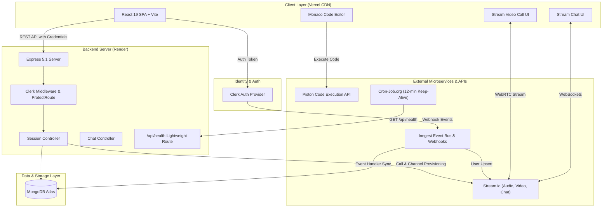

<div align="center">

# 🚀 Career Connect
### Real-Time Collaborative Technical Interview & Pair Programming Platform

[](https://career-connect-main.onrender.com)
[](https://career-connect-main.onrender.com/api/health)
[](LICENSE)
[](https://github.com/devashishhaldar2006/career-connect/stargazers)

<p align="center">
  <b>Practice coding interviews in real-time with integrated HD video streaming, synchronized chat channels, interactive Monaco code editing, multi-language sandbox execution, and event-driven user orchestration.</b>
</p>

[🌐 Live Application](https://career-connect-main.onrender.com) • [📡 Backend Health Check](https://career-connect-main.onrender.com/api/health) • [📖 Documentation](#-architecture--system-design) • [⚡ Quickstart](#-getting-started) • [📬 API Reference](#-api-documentation)

---

</div>

## 📑 Table of Contents

- [Overview](#-overview)
- [System Architecture](#-system-architecture)
- [Key Features](#-key-features)
- [Tech Stack Deep-Dive](#-tech-stack-deep-dive)
- [Project Directory Structure](#-project-directory-structure)
- [API Documentation](#-api-documentation)
- [Database Schema (MongoDB)](#-database-schema-mongodb)
- [Event & Webhook Workflow (Inngest & Clerk)](#-event--webhook-workflow-inngest--clerk)
- [Real-Time Audio/Video & Chat (Stream.io)](#-real-time-audiovideo--chat-streamio)
- [Live Code Execution Engine (Piston)](#-live-code-execution-engine-piston)
- [Environment Variables](#-environment-variables)
- [Getting Started (Local Development)](#-getting-started-local-development)
- [Deployment Guide (Vercel + Render + Keep-Alive)](#-deployment-guide-vercel--render--keep-alive)
- [Contributing](#-contributing)
- [Author & Acknowledgements](#-author--acknowledgements)

---

## 🎯 Overview

**Career Connect** is an end-to-end fullstack platform built to simulate authentic technical interviews and pair programming sessions. It addresses the fragmentation of typical interview setups—where developers juggle separate video calling links, chat apps, shared documents, and online compilers—by combining everything into a unified, responsive workspace.

### Highlights
* **Zero Disconnection Friction**: Split production architecture with static frontend deployed to **Vercel edge** and API service running on **Render**.
* **High-Definition WebRTC Video**: Low-latency video calls and screensharing using **Stream Video SDK**.
* **Synchronized Session Chat**: Session-scoped messaging channels with **Stream Chat React**.
* **In-Browser Code Execution**: Instant test case validation across JavaScript, Python, and Java powered by the **Piston Code Execution Engine**.
* **Automated Identity Sync**: Secure user authentication with **Clerk**, synced seamlessly to MongoDB and Stream via **Inngest event workflows**.

---

## 🏛 System Architecture



---

## ✨ Key Features

### 1. 🏠 Interactive Interview Dashboard
- **Live Metric Counter**: Real-time stats displaying active sessions, personal interview history, and completed problem metrics.
- **Active Session Discovery**: Interactive list of active rooms created by peers with problem descriptions, tags, and difficulty badges.
- **One-Click Session Creator**: Modal interface to select problems across difficulty bands (Easy, Medium, Hard), instantiate a unique room ID, and provision Stream WebRTC credentials.

### 2. 💻 Coding Workspace & Real-Time Collaboration
- **Integrated Monaco Editor**:
  - Full syntax highlighting, tab autocompletion, bracket matching, and multi-language support (JavaScript, Python, Java).
  - Pre-populated starter code and test harness for each problem.
- **Resizable Layout Panels**: Built on `react-resizable-panels` allowing candidates to dynamically resize problem instructions, code editor, video feed, and output consoles.
- **In-Browser Execution Console**: Runs code via Piston API against test suites and formats `stdout`, `stderr`, and compilation errors instantly.

### 3. 🎥 Real-Time Audio / Video & Live Messaging
- **Stream Video SDK**: Multi-participant HD video grid, mic/cam mute controls, device selector, and call screen state handling.
- **In-Room Messaging**: Contextual chat sidebar linked to the active session ID with read receipts, participant presence, and persistent message history.
- **Host Session Lifecycle Controls**: Host privileges to conclude sessions, triggering automatic teardown of Stream video calls and chat channels to prevent orphaned resources.

### 4. 🔒 Enterprise-Grade Identity & Syncing
- **Clerk Authentication**: Social logins (Google, GitHub) + passwordless session tokens.
- **Asynchronous Webhook Sync**: Background event queues via Inngest synchronizing Clerk `user.created` and `user.deleted` events directly with MongoDB and Stream user directories.

---

## 🛠 Tech Stack Deep-Dive

### Frontend
| Technology | Version | Purpose |
| :--- | :--- | :--- |
| **React** | `19.1.1` | Declarative UI rendering & state orchestration |
| **Vite** | `7.3.0` | Ultra-fast client build tool & asset bundler |
| **React Router** | `7.9.4` | Client-side declarative routing and URL parameterization |
| **Tailwind CSS** | `4.1.14` | High-performance CSS design system |
| **DaisyUI** | `5.3.10` | Accessible component library built for Tailwind |
| **Monaco Editor** | `4.7.0` | In-browser VS Code editing experience |
| **Stream Video React SDK** | `1.24.0` | WebRTC audio/video call management |
| **Stream Chat React** | `13.9.0` | Real-time chat channel and message components |
| **TanStack React Query** | `5.90.5` | Server-state caching, optimistic mutations, refetching |
| **Axios** | `1.12.2` | Promise-based HTTP client with credentials support |
| **Lucide React** | `0.562.0` | Clean, modern iconography |
| **React Hot Toast** | `2.6.0` | Non-blocking toast notifications |

### Backend
| Technology | Version | Purpose |
| :--- | :--- | :--- |
| **Node.js** | `>= 18.0` | Cross-platform JavaScript runtime environment |
| **Express** | `5.1.0` | REST API framework handling session and chat endpoints |
| **MongoDB & Mongoose** | `8.19.1` | Document database for users, sessions, and status records |
| **@clerk/express** | `1.7.41` | Server-side Clerk JWT validation & session injection |
| **@stream-io/node-sdk** | `0.7.12` | Stream server SDK for video call & token creation |
| **stream-chat** | `9.24.0` | Server-side channel creation, member provisioning & cleanup |
| **Inngest** | `3.44.3` | Event-driven workflow orchestrator for webhook processing |
| **CORS** | `2.8.5` | Configured multi-origin resource sharing with credentials |

---

## 📁 Project Directory Structure

```
career-connect/
├── backend/
│   ├── src/
│   │   ├── controllers/
│   │   │   ├── chatController.js       # Stream Chat token generation handler
│   │   │   └── sessionController.js    # Session CRUD, join/end room lifecycle
│   │   ├── lib/
│   │   │   ├── db.js                   # Mongoose MongoDB connection client
│   │   │   ├── env.js                  # Centralized, validated environment configuration
│   │   │   ├── inngest.js              # Inngest event functions (sync/delete users)
│   │   │   └── stream.js               # Stream Video & Chat server instances
│   │   ├── middlewares/
│   │   │   └── protectRoute.js         # Clerk JWT validation & user resolution
│   │   ├── models/
│   │   │   ├── Session.js              # Session schema & status lifecycle
│   │   │   └── User.js                 # User document schema
│   │   ├── routes/
│   │   │   ├── chatRoutes.js           # /api/chat endpoints
│   │   │   └── sessionRoutes.js        # /api/sessions endpoints
│   │   └── server.js                   # Express application setup & health-check
│   ├── package.json
│   └── .env
│
├── frontend/
│   ├── src/
│   │   ├── api/
│   │   │   └── sessions.js             # API service layer wrapping Axios endpoints
│   │   ├── components/
│   │   │   ├── ActiveSessions.jsx      # Feed of available active interview rooms
│   │   │   ├── CodeEditorPanel.jsx     # Monaco editor container with language toggles
│   │   │   ├── CreateSessionModal.jsx  # Modal for new session parameters
│   │   │   ├── Navbar.jsx              # Navigation header with Clerk UserButton
│   │   │   ├── OutputPanel.jsx         # Code output and test case evaluation view
│   │   │   ├── ProblemDescription.jsx  # Problem statement, examples, and constraints
│   │   │   ├── RecentSessions.jsx      # Completed session historical feed
│   │   │   ├── StatsCards.jsx          # User performance and session metric cards
│   │   │   ├── VideoCallUI.jsx         # Audio/Video call controls and participant feed
│   │   │   └── WelcomeSection.jsx      # Dashboard banner with quick actions
│   │   ├── data/
│   │   │   └── problems.js             # Curated problem set with starter code & test cases
│   │   ├── hooks/
│   │   │   ├── useSessions.js          # React Query hooks for session lifecycle
│   │   │   └── useStreamClient.js      # Stream video and chat connection hook
│   │   ├── lib/
│   │   │   ├── axios.js                # Configured Axios instance (with credentials)
│   │   │   ├── piston.js               # Code execution client for Piston API
│   │   │   ├── stream.js               # Stream Client factory
│   │   │   └── utils.js                # Helper formatters and styling utilities
│   │   ├── pages/
│   │   │   ├── DashboardPage.jsx       # Main dashboard layout
│   │   │   ├── HomePage.jsx            # Landing / Hero introduction page
│   │   │   ├── ProblemPage.jsx         # Solo problem practice page
│   │   │   ├── ProblemsPage.jsx        # Problem bank library
│   │   │   └── SessionPage.jsx         # Live collaborative interview arena
│   │   ├── App.jsx                     # Route definitions & layout wrappers
│   │   ├── main.jsx                    # Root ReactDOM render with Clerk & React Query
│   │   └── index.css                   # Tailwind CSS imports & theme overrides
│   ├── vercel.json                     # SPA rewrite rules for Vercel deployment
│   ├── package.json
│   └── vite.config.js
│
└── package.json                        # Root orchestration scripts
```

---

## 📚 API Documentation

### Base URL
- **Production Backend**: `https://career-connect-main.onrender.com/api`
- **Local Backend**: `http://localhost:5000/api`

### Health Check (Lightweight Keep-Alive)
```http
GET /api/health
```
- **Description**: Returns instant server uptime without querying database or running authentication.
- **Response `200 OK`**:
```json
{
  "status": "ok",
  "uptime": 4155.33,
  "timestamp": "2026-09-17T10:03:45.251Z"
}
```

---

### Sessions Endpoints (`/api/sessions`)

| Method | Endpoint | Auth Required | Description |
| :--- | :--- | :---: | :--- |
| `POST` | `/api/sessions` | Yes | Creates a session, registers Stream call, and provisions chat channel |
| `GET` | `/api/sessions/active` | Yes | Retrieves up to 20 currently active interview sessions |
| `GET` | `/api/sessions/my-recent` | Yes | Fetches recent completed sessions for the authenticated user |
| `GET` | `/api/sessions/:id` | Yes | Fetches a single session with host & participant population |
| `POST` | `/api/sessions/:id/join` | Yes | Joins an active session as a participant & attaches chat membership |
| `POST` | `/api/sessions/:id/end` | Yes | Concludes session (host only); tears down video and chat instances |

#### Example: Create Session
```http
POST /api/sessions
Content-Type: application/json
Authorization: Bearer <clerk_token>

{
  "problem": "Two Sum",
  "difficulty": "easy"
}
```
**Response `201 Created`**:
```json
{
  "session": {
    "_id": "66e92efb123456789abcdef0",
    "problem": "Two Sum",
    "difficulty": "easy",
    "host": "66e92efb123456789abcdef1",
    "participant": null,
    "status": "active",
    "callId": "session_1726567163000_a1b2c3",
    "createdAt": "2026-09-17T09:59:23.000Z",
    "updatedAt": "2026-09-17T09:59:23.000Z"
  }
}
```

---

### Chat Endpoints (`/api/chat`)

| Method | Endpoint | Auth Required | Description |
| :--- | :--- | :---: | :--- |
| `GET` | `/api/chat/token` | Yes | Generates user-scoped Stream Chat token for the authenticated user |

**Response `200 OK`**:
```json
{
  "token": "eyJhbGciOiJIUzI1NiIsInR5cCI6IkpXVCJ9..."
}
```

---

## 🗄 Database Schema (MongoDB)

### User Model (`User.js`)
```javascript
{
  name: { type: String, required: true },
  email: { type: String, required: true, unique: true },
  profileImage: { type: String, default: "" },
  clerkId: { type: String, required: true, unique: true },
  timestamps: true
}
```

### Session Model (`Session.js`)
```javascript
{
  problem: { type: String, required: true },
  difficulty: { type: String, enum: ["easy", "medium", "hard"], required: true },
  host: { type: mongoose.Schema.Types.ObjectId, ref: "User", required: true },
  participant: { type: mongoose.Schema.Types.ObjectId, ref: "User", default: null },
  status: { type: String, enum: ["active", "completed"], default: "active" },
  callId: { type: String, default: "" },
  timestamps: true
}
```

---

## 🔄 Event & Webhook Workflow (Inngest & Clerk)

```
[Clerk User Action]
       │
       ▼ (Webhook Event: clerk/user.created)
[Inngest Event Bus (/api/inngest)]
       │
       ├─► 1. Upsert User Document in MongoDB
       └─► 2. Provision & Register User with Stream.io Video & Chat API
```

1. When a candidate signs up or signs in through Clerk, a webhook fires into the `/api/inngest` endpoint.
2. Inngest manages retries, idempotency, and concurrency to prevent duplicate user creation.
3. If an account is deleted via Clerk, `user.deleted` automatically unbinds the user in MongoDB and deregisters their Stream credentials.

---

## 💻 Live Code Execution Engine (Piston)

Career Connect utilizes the **Piston API** to safely execute arbitrary code in isolated sandboxes. Supported environments:

| Language | Runtime Version | Extension |
| :--- | :--- | :--- |
| **JavaScript** | Node.js `18.15.0` | `.js` |
| **Python** | Python `3.10.0` | `.py` |
| **Java** | OpenJDK `15.0.2` | `.java` |

The execution service captures both `stdout` and `stderr`, streaming back real-time feedback with execution duration and exit codes.

---

## 🔐 Environment Variables

### Backend Configuration (`backend/.env`)

```env
PORT=5000
NODE_ENV=production

# Database
DB_URL=mongodb+srv://<username>:<password>@cluster.mongodb.net/career-connect?retryWrites=true&w=majority

# CORS Configuration (comma-separated origins supported)
CLIENT_URL=http://localhost:5173,https://career-connect-main.onrender.com

# Clerk Authentication
CLERK_PUBLISHABLE_KEY=pk_test_...
CLERK_SECRET_KEY=sk_test_...

# Stream.io Video & Chat
STREAM_API_KEY=your_stream_api_key
STREAM_API_SECRET=your_stream_api_secret

# Inngest Background Workflows
INNGEST_EVENT_KEY=your_inngest_event_key
INNGEST_SIGNING_KEY=your_inngest_signing_key
```

### Frontend Configuration (`frontend/.env`)

```env
VITE_API_URL=https://career-connect-main.onrender.com/api
VITE_CLERK_PUBLISHABLE_KEY=pk_test_...
VITE_STREAM_API_KEY=your_stream_api_key
```

---

## ⚡ Getting Started (Local Development)

### Prerequisites
- [Node.js (v18+)](https://nodejs.org/)
- [MongoDB Community Server](https://www.mongodb.com/try/download/community) or [MongoDB Atlas](https://www.mongodb.com/atlas)
- Accounts with [Clerk](https://clerk.com) and [Stream.io](https://getstream.io)

### 1. Clone the Repository
```bash
git clone https://github.com/devashishhaldar2006/career-connect.git
cd career-connect
```

### 2. Install Dependencies
```bash
# Install backend dependencies
cd backend
npm install

# Install frontend dependencies
cd ../frontend
npm install
```

### 3. Setup Environment Variables
Populate `backend/.env` and `frontend/.env` using the specifications in the [Environment Variables](#-environment-variables) section.

### 4. Run Development Servers
Open two terminal windows:

**Terminal 1 (Backend):**
```bash
cd backend
npm run dev
```
*Backend runs on `http://localhost:5000`*

**Terminal 2 (Frontend):**
```bash
cd frontend
npm run dev
```
*Frontend runs on `http://localhost:5173`*

---

## 🚢 Deployment Guide (Vercel + Render + Keep-Alive)

To maintain a **100% free, zero-sleep deployment**, Career Connect splits the architecture into a static CDN frontend and an on-demand API backend.

### 1. Backend on Render (Free Web Service)
1. In [Render Dashboard](https://dashboard.render.com), click **New +** -> **Web Service**.
2. Connect your `career-connect` GitHub repository.
3. Configure settings:
   - **Root Directory**: `backend`
   - **Build Command**: `npm install`
   - **Start Command**: `node src/server.js`
   - **Instance Type**: `Free`
4. Add all environment variables specified in `backend/.env`.
5. Set **Health Check Path** to `/api/health`.

### 2. Frontend on Vercel
1. In [Vercel Dashboard](https://vercel.com), select **Add New...** -> **Project**.
2. Set **Root Directory** to `frontend`.
3. Framework preset automatically detects `Vite`.
4. Add environment variables:
   - `VITE_API_URL`: `https://career-connect-main.onrender.com/api`
   - `VITE_CLERK_PUBLISHABLE_KEY`: your Clerk publishable key
   - `VITE_STREAM_API_KEY`: your Stream API key
5. Deploy. (Client-side routing is handled seamlessly via `frontend/vercel.json`).

### 3. Keep-Alive Strategy (Preventing Cold Starts)
1. Go to [cron-job.org](https://cron-job.org).
2. Create a recurring cron job:
   - **URL**: `https://career-connect-main.onrender.com/api/health`
   - **Schedule**: Every `10` or `12` minutes.
   - **Method**: `GET`
3. Because `/api/health` responds in < 5ms without querying MongoDB, this keeps the free instance perpetually warm without exhausting Render's free tier hours.

---

## 🤝 Contributing

Contributions make the open-source community thrive. Any contributions you make are **greatly appreciated**!

1. Fork the Project
2. Create your Feature Branch (`git checkout -b feature/NewAwesomeFeature`)
3. Commit your Changes (`git commit -m 'Add NewAwesomeFeature'`)
4. Push to the Branch (`git push origin feature/NewAwesomeFeature`)
5. Open a Pull Request

---

## 👨‍💻 Author & Acknowledgements

**Devashish Haldar**
- **GitHub**: [@devashishhaldar2006](https://github.com/devashishhaldar2006)
- **LinkedIn**: [Devashish Haldar](https://www.linkedin.com/in/devashish-haldar)
- **Portfolio**: [devashishhaldar.me](https://devashishhaldar2006.github.io/portfolio/)

### Acknowledgements
- [Stream.io](https://getstream.io) for video calling and chat infrastructure
- [Clerk](https://clerk.com) for authentication and identity orchestration
- [Monaco Editor](https://microsoft.github.io/monaco-editor/) for editor tooling
- [Piston API](https://github.com/engineer-man/piston) for code execution sandboxes
- [Inngest](https://www.inngest.com) for event workflows
- [DaisyUI & Tailwind CSS](https://daisyui.com) for modern UI components

---

<div align="center">
  <sub>Built with ❤️ by Devashish Haldar. ⭐ Star this repo if you find it helpful!</sub>
</div>
